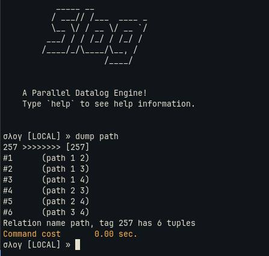

## A Simple Example : Transitive Closure

Given you have a docker container with [slog set-up](./setup_slog.md). This article shows `Transitive Closure` in slog, as an example to introduce some of the basic functionality. 

TC program in slog, looks like:
```slog
[(path x y) <-- (edge x y)]
[(path x y) <-- (edge x z) (path z y)]
```

Here `path` and `edge` are two relations, `edge` is the input graph/relation, and path is the output relation. Slog infers what is input and output from the rules. 

Each rule has a `head` and a `body`,  the arrow points from body to head, if all body clauses are true, head is deduced.

In the example, 
- The first rule says that, if relation edge has a tuple `(x y)` add the tuple to path relation.
- Second rule is recursive, with `path` in both head and body, if there is an edge from x to z and there is a path from z to y, then add a path between x y.
- Second rule expands the paths by `1` hop for each iteration, reaching a fixed point when all the nodes are reached.

### Run TC
- Put the above program in `tc.slog` file.
- Input for the program i.e., facts for the `edge` relation, can be directly stored in `tc.slog` or can be picked from a tab separated file.
- To use the input folder option, a folder with edge.csv file needs to be passed to runslog. The edge.csv file can look like,
```tsv
1	2
2	3
3	4
```
- This is the structure of the dir we are using,
```tree
TC/
|-- input
|   `-- edge.csv
|-- output
`-- src
    `-- tc.slog

3 directories, 2 files
```
- For this example, slog can be run from the `/slog` using
```bash
./runslog -R --facts /TC/input/ /TC/src/tc.slog /TC/output/
```
- `./runslog -h` shows the options available, or jump to [REPL and runslog](./repl_and_runslog.md) for more details about runslog.
- Once the execution is done,it drops into the REPL, and running `dump path` displays the facts in path relation.



For more of a tutorial, jump to [Tutorial](./tutorial.md). 
