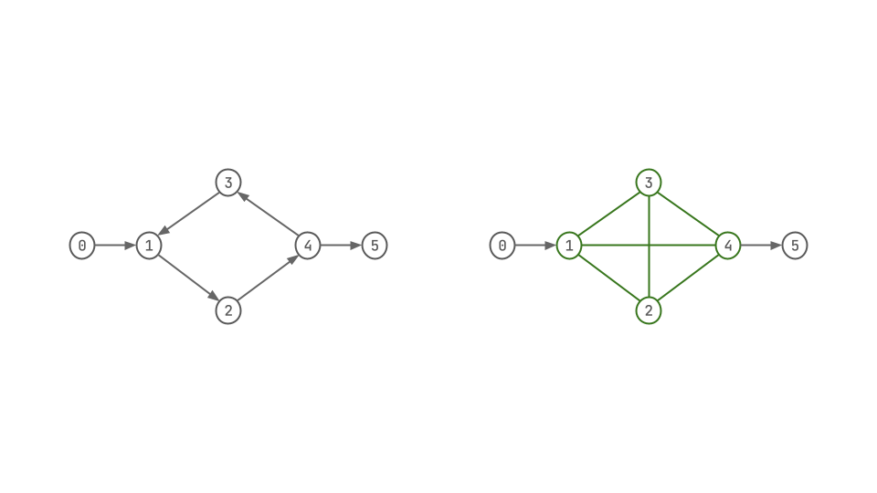

## Tutorial


To Learn more about how slog works internally and a more substantial explanation, please refer to [Slog Paper on arXiv](https://arxiv.org/abs/2211.11573)

In here, We will look at some examples and Arithmetic functor's & Aggregators at a surface level to get you started writing programs in slog.

This article assumes you have [Set Up Slog](./setup_slog.md), and have gone through [A Simple Example](./TC.md).

-----------------------------------------------------------------------
### Meta:
- [x] Talk about Nested Facts, Free-Variable in slog-wiki does that.
- [ ] Mention that spaces in string break the parser
- [x] explicit dis-junction in the body using or
- [x] can have multiple heads in the head
- [x] What is {}, How does it work?
- [x] How to talk about \_ what is this, and how is it used
- [ ] What is -- and how does that work, this is for manually specifying order of joins. [here](https://github.com/harp-lab/slog/blob/docs/docs/compare.md#body-clause-partition)
- [ ] Are floats supported in the language???
- [ ] No support for relations of multiple arity like `(bar 1 2)` `(bar 1 2 3)` is not allowed
- [ ] ~ outside the paren or inside the paren, do they mean the same thing???, which syntax is correct?
- [x] Talk about how lists work, look at yihao's sssp and list.slog
---------------------------------------------------------------------------
We will introduce features and syntax through different examples,

### Free Vars
Finding free vars in a lambda expression using slog, for example take this lambda expression, here `z` is a free-var:
```lambda-cal
(lam (y) (lam (x) (y (z x))))
```
- To write this out as a slog fact, we can make use of nested facts, and write this as
```slog
(lam "y" (lam "x" (app (ref "y") (app (ref "z") (ref "x")))))
```
- If you run slog with just the fact above,  you will notice that there are three different relations, `lam`, `app` and `ref` generated from this fact. Slog's support for first class facts helps us model hierarchy more naturally [help].
- The program to get the free-var in the expression has the following three rules:
```slog
[(free x (ref x)) <-- (ref x)]
```
- For every `ref` tuple, create a `free`, in isolation every ref fact has a free-var.
- we can write the above rule as:
```slog
(free x ?(ref x))
```
- `?` is syntactic sugar, and the above rule gets desugared to the prior rule, and next two rules use this convenience to make rules simpler.
```slog
[(free x ?(lam y eb)) <-- (free x eb) (=/= x y)]

[(free x ?(app ef ea)) <-- (or (free x ef) (free x ea))]
```
- The above two rules, introduce two new features, `or` and `=/=`. `or` is used for dis-junction in the body. `=/=` is used to express `not equal to` operator.

### Same Generation
- This example is taken from [Souffle's tutorial](https://souffle-lang.github.io/tutorial#same-generation-example), and follows the same pattern.
- Gives a tree, directed acyclic graph, Same generation is to find nodes that are the same level in the tree.
```slog
(parent "d" "b") 
(parent "e" "b") 
(parent "f" "c")
(parent "g" "c") 
(parent "b" "a") 
(parent "c" "a")

[(person x) (person y) <-- (parent x y)]

[(samegen x x) <-- (person x)]

[(samegen x y) <-- (parent x p) (samegen p q) (parent y q)]
```
- Here the first rule, has multiple heads, which can be written as
```
[(person x) <-- (parent x _)]
[(person x) <-- (parent _ x)]
```
- In the above rules \_ matches with any value and doesn't assign it to any variable for use in the head.[help]

### Extending TC
#### SCC
- We can extend on our [TC](./TC.md) example and extend it to compute, which nodes are strongly connected.
```slog
[(path x y) <-- (edge x y)]
[(path x y) <-- (edge x z) (path z y)]

; strongly connected components
[(scc x y) <-- (path x y) (path y x)]
```
- Here `scc` holds all the edges that are strongly connected, an example graph and its scc is shown below

- Here, the nodes `1,2,3,4` are strongly connected.
- How to group nodes in a scc, if there are two scc regions in a graph. [todo]
#### Cyclic?
- Check whether a node is part of a cycle, add this rules to the TC
```slog
[(cyclic x) <-- (path x x)]
```
#### Acyclic?
- Does graph have any cycles?
```
[(acylic)  <-- ~(cyclic _)]
```
- If none of the nodes are cyclic, the graph is acyclic

### Arithmetic Functors
- In this example, we try and use arithmetic functor's in slog.
- Slog supports `+, -, *, /`, simplest examples would be just directly use them.
```slog
(plus {+ 1 1}) ;does the computation eagerly and adds the fact (plus 2) to the database
[(plus {+ acc 1}) <-- (plus acc) (< acc 5)]

(minus {- 0 1})
[(minus {- acc 1}) <-- (minus acc) (> acc -5)]

(multiply {* 1 2} 1)
[(multiply {* acc 2} {+ 1 power}) <-- (multiply acc power) (<= power 5)]

(divide {/ 128 1})
[(divide {/ acc 2}) <-- (divide acc)]
```
- The arithmetic ops in curly braces are done eagerly.
- They can also be written without curly braces, using more traditional syntax.
```slog
[(+ 1 1 val) --> (plus val)]
[(plus acc) (< acc 5) (+ acc 1 val) --> (plus val)]
```
- All the arith ops in the main example can be written in this form.
- You can also see the use of comparison operators, Slog supports `<, >, <=, >=, =, =/=`
#### Factorial
- Here is factorial written in slog, try it as an exercise before proceeding.
```slog
[(fact {- n 1} {* acc n}) <-- (fact n acc) (> n 0)]
(fact 5 1)

[(factorial n) <-- (fact x n) (= x 0)]
```
- The first rule is recursive, computes and stores every step of factorial as a tuple in fact relation. The `(fact 5 1)`, triggers the first rule.
- The second rule, just pulls out the final factorial value from the fact relation.

### Aggregators
- Slog supports `count, minimum, maximum, sum` , Aggregators are same as you know from the SQL.
#### Count
```slog
;; Count
(edge 1 2) (edge 1 4) (edge 2 3) (edge 2 4) (edge 2 5) (edge 2 6) (edge 3 3) (edge 3 4) (edge 5 3)

;; Add the all the nodes with outgoing edges to node relation
[(edge x y) --> (node x)]

;; For each node, count the number of edges outgoing from it and accumulate in degree
[(node x) (count edge x _ degree) --> (node-degree x degree)]

;; below rule, does the same above two rules combined
;; matches on outgoing node in edge and uses that in count to get degree
[(edge x _) (count edge x _ degree) --> (node-degree-edge x degree)]

;; Another example of using count, this rules just counts the number of edges in edge relation
[(count edge _ _ degree) --> (edge-count degree)]

```
- The last three rules, show how count can be used. Think of something else to count and use these as examples.

#### Sum
```slog
;; sum
(b-foo 1 1) (b-foo 1 2) (b-foo 1 3)
(b-foo 2 3)

[(sum b-foo _ S) --> (b-foo-sum-1 S)]
[(b-foo x _) (sum b-foo x S) --> (b-foo-sum-2 x S)]
[(b-foo x _) (> x 1) (sum b-foo x S) --> (b-foo-sum-3 x S)]
```
- Here we have a `b-foo`, with two columns.
- First rule, sums all the values in the second column.
- Second rule, sums all the second column values for each first column value.
- Third rule, sums all the second columns values for each first column value, where first column value is greater than 1.
- Syntax is fairly similar to count.
#### Maximum and Minimum
```slog
;; maximum && minimum
(c-foo "a" 1) (c-foo "a" 10) (c-foo "a" 100) (c-foo "a" 1000)
(c-foo "b" 2) (c-foo "b" 20) (c-foo "b" 200) (c-foo "b" 2000)

[(c-foo x _) (maximum c-foo x max_col2) --> (c-foo-max x max_col2)]
[(c-foo x _) (minimum c-foo x min_col2) --> (c-foo-min x min_col2)]
```
- Again the syntax is similar to above aggregators.
- Here we have `c-foo` relation with two columns, we want the maximum/minimum for the second column, for each distinct first column value.
#### SSSP - Min dist
- Using the aggregators, we can calculate Single Source Shortest Path distance for a node in the graph.
```slog
; (edge src dst weight)
(edge 1 2 1) (edge 2 3 2) (edge 2 4 1)
(edge 3 5 2) (edge 4 5 1) (edge 5 6 2)

; (path dst-node weight)
; we will pick 1 as the src node, and set the weight to itself as 0
(path 1 0)

; this rules gets the distance from 1 to each node
[(path x costx) (edge x y weightxy) --> (path y {+ costx weightxy})]

; Have to filter path and get the minimum weight nodes
[(path x _) (minimum path x min_dist) --> (sssp x min_dist)]
```
- First we accumulate the distances to all nodes from src across different paths.
- Final rule, we use minimum aggregator to find the shortest distance between the `x` or `src` and each node.
### Lists and usage
- Ability to *support nested facts*  means slog support linked lists.
```slog
(lst 1 (lst 2 (lst 3 (lst 4 (nil )))))
```
- The above is a valid fact in slog and is basically a singly linked list.
- Once we have list, we need to be able to do some operations on the list, The following examples will show how you can write `length`, `member`, `append`, `reverse`, `split` etc.
- In these operations example, we will also introduce `!` form, which lets us eagerly generate facts from a rule, before evaluating the surrounding fact, much like a function call.
- Getting a basic understanding of how `!` and nested facts work satisfies the goal of these examples.
#### Length
- Think about, how we can do this, We can to look at outer list, unwrap one element, increase the length by one, and keep doing this till we see a `(nil )` fact.
- Here is the slog program to calculate the length of a slog-list.
```slog
(input-list (list 1 (list 2 (list 3 (nil)))))

(length ?(do-length (nil)) 0)

[(length ?(do-length (list hd rst)) {+ len-rst 1}) 
    <-- (length !(do-length rst) len-rst)]

[(print-length-res res)
    <-- (length !(do-length {input-list}) res)]

```
- To make this easier to understand let's desugar the `?` form and point the arrows from body to head and reorder the rules to match the explanation.
```slog
;  list operation
(input-list (list 1 (list 2 (list 3 (nil)))))

[(length !(do-length {input-list}) res) 
    --> (print-length-res res)]

[(do-length (list hd rst)) (length !(do-length rst) len-rst) 
    --> (length (do-length (list hd rst)) {+ len-rst 1})]

[(do-length (nil)) 
    --> (length (do-length (nil)) 0)]
```
- The first line is the list creation, the list is in a relation named input-list, it has three elements `'(1 2 3)`, `(nil)` acts as a marker for end of the list.
- First Rule:
	- Body has a `length`, fact that has `do-length` with exclamation, which has `input-list` in curly braces, and `res` at the end.
	- At this point, the DB doesn't have any `length` facts, but how `!` works is, before it's surrounding rule is executed, `do-length` gets added to the DB, and it triggers some rules, once those rules are done, `do-length` will "return", then it's surrounding rule is evaluated.
	- It is like a function call, when `do-length` returns, there will be length facts in the database, and the surrounding rule goes through.
	- One more item here, Curly braces wrapping the relation name `input-list`, Curly braces leads to eager execution, in this case, `input-list` is replaced with tuples inside the relation, in our case only one list, there can be more lists in the input-list relation.
	- Like `(input-list (list 4 (list 5 (list 6 (list 7 (nil))))))`, and do length would be triggered on both lists.
- Second Rule:
	- Now, that `(do-length (list 1 (list 2 (list 3 (nil)))))` is in the database, it triggers the second rule.
	- In the body of the second rule, we see something similar to what is in the first rule, except `do-length` is being "called" for rest of the list, and when it return head has `{+ len-rst 1}`, which emits length fact with increased length.
	- This cycle happens, till `(do-length (nil))`, in which case third rules gets triggered emitting the first `length` fact with `len-rst` as zero.
	- This length fact, now satisfies the rule triggered by `(do-length (list 1 (nil)))`, which emits the second length fact `(length (do-length (list 1 (nil))))`, which satisfies the "second" rule triggered by `(do-length (list 2 (list 1 (nil))))`. This is like recursive call returning to its caller and so on.
- Hope that is helpful, Run the program, dump facts in REPL and play around.
- That example introduces `!` form, and working with nested facts. For the next list-operations, we will list the slog code, and basic explanation.

#### Member
```slog
(member ?(do-member x (nil)) (false))
(member ?(do-member x (list x rst)) (true))
[(member ?(do-member x (list hd rst)) (true)) 
    <-- (=/= hd x) (member !(do-member x rst) (true))]
[(member ?(do-member x (list hd rst)) (false)) 
    <-- (=/= hd x) (member !(do-member x rst) (false))]
[(print-member-res res) <--
	(member !(do-member 2 {input-list}) res)] 
;; 2 in the line above is element we are looking for
```
- This takes a `input-list` like length does, and unwraps the list, and at each unwrapping uses `!` to generate do-member for the rest of the body. The top rules are the base cases.
- First one, if the list is `(nil)`, element is not found, and emits `member` fact with false.
- Second one, if the current head matches the element, emits a `member` fact with true.
- 3rd and 4th rules, are pick up `true` and `false` cases respectively.
- The use of `!` and `{}` is identical to the `length` program.
#### Append an element
```slog
(append ?(do-append (nil) x) (list x (nil)))
[(append ?(do-append (list hd tail) x) (list hd tail-appended)) 
    <-- (append !(do-append tail x) tail-appended)]

[(print-append-res list) <-- (append !(do-append {input-list} 4) list)]
```
- Takes an input list and append an element to it.
- Inspect the `print-append-res` and `append` relation in the REPL to better understanding how append works.
#### Reverse a list
```slog
(reverse (do-reverse (nil)) (nil))
[(reverse ?(do-reverse (list hd tail)) {append !(do-append r hd)}) 
    <-- (reverse !(do-reverse tail) r)]
[(print-reverse-res list) 
    <-- (reverse !(do-reverse {input-list}) list)]
```
- This uses append, Takes each element from the head and adds into a list, giving the reverse of a list.
#### SSSP - Path
- In these example, we will use the goodness of lists to extend our SSSP example, which gives the min-dist to all the nodes from a source node, to also give us the paths that are min-dist.
```slog
(a-edge 1 2 1) (a-edge 2 3 2) (a-edge 2 4 1)
(a-edge 3 5 2) (a-edge 4 5 1) (a-edge 5 6 2)

(member ?(do-member x (nil)) (false))
(member ?(do-member x (list x rst)) (true))
[(member ?(do-member x (list hd rst)) (true)) <-- (=/= hd x) (member !(do-member x rst) (true))]
[(member ?(do-member x (list hd rst)) (false)) <-- (=/= hd x) (member !(do-member x rst) (false))]
[(do-member 2 l) <-- (input-list l)]

[(node a) (node b) <-- (a-edge a b _)]
(source-node 1)

[(path from to (list to (list from (nil ))) w) <-- (a-edge from to w)]
[(print-path from to (list to (list from (nil ))) w) <-- (a-edge from to w)]
[(path from mid pt acc-w)
 (a-edge mid to w)
 (member !(do-member to pt) (false))
    -->
    (path from to (list to pt) {+ acc-w w})]
[(shortest-dist from to {minimum path from to _}) <-- (path from to _ _) (source-node from)]
[(shortest-dist from to dist) (path from to pt dist) --> (shortest-path from to pt dist)]

```
- Explanation [todo] 

### Sources 
- Some Examples are picked from sources written by [Sun Yihao](https://github.com/StarGazerM), [Akshar Patel](https://github.com/akshar2020)
- [Slog Paper on arXiv](https://arxiv.org/abs/2211.11573) 
- [Souffle's tutorial](https://souffle-lang.github.io/tutorial#same-generation-example)
