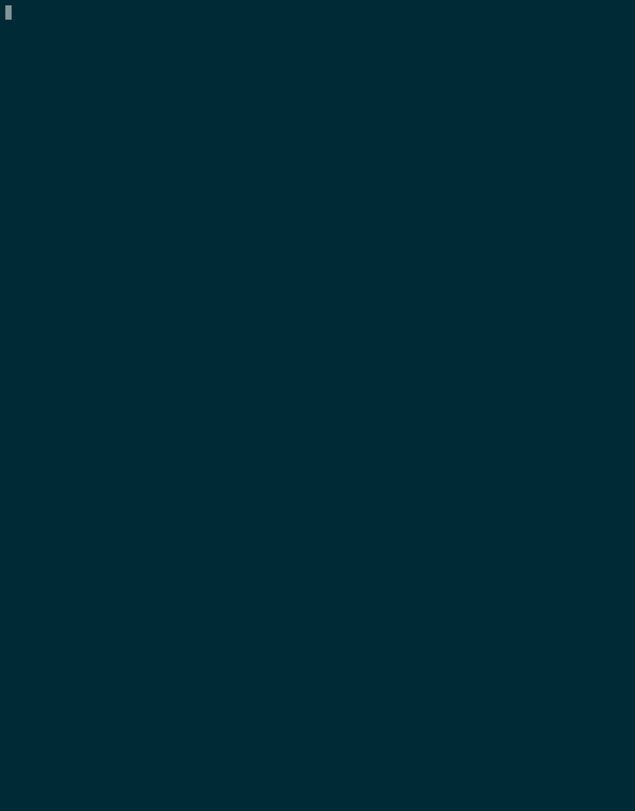

# Run Slog
Running Slog depends on your form of installation: Choose your installation method below
1. [Docker](##Running-within-docker)
2. [Terminal](##Running-in-the-terminal)
3. [Apple Sillicon MacOS](##Running-in-the-terminal)

## Running within Docker


## Running in the terminal
This method works for both terminal installs and M1/M2 chip installs
- If running within the Docker container, make sure your terminal is of the Docker container
```bash
#Navigate to the base slog folder
1. ./runslog -R <path to your slog file> <path to where you want the outfiles to be>
```
Your slog path is where your slog file is located, while the out file is where you want the compiled files to go. 
The `-R` flag allows you to access the `REPL` and interact with your relations and facts after the program has completed. 
### How to use the REPL
The REPL supports the following features while running in the terminal:
```bash
1. help                print help info
2. dump <rel>          dump all facts inside a relation
3. relations           print all relation meta info in current database
4. find                find facts containing a specific piece of text
-  find is under development
```
